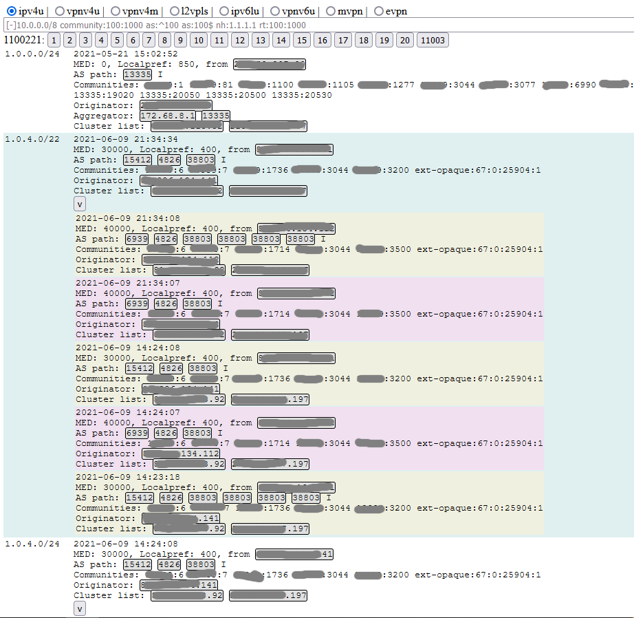
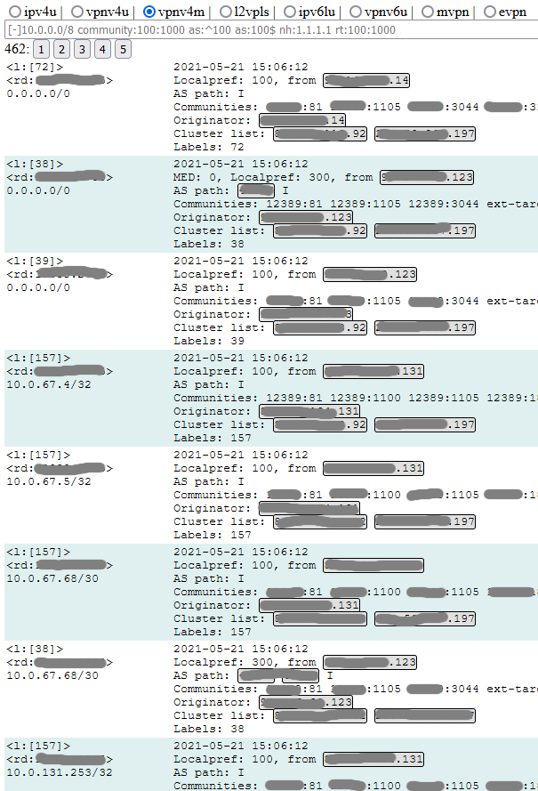
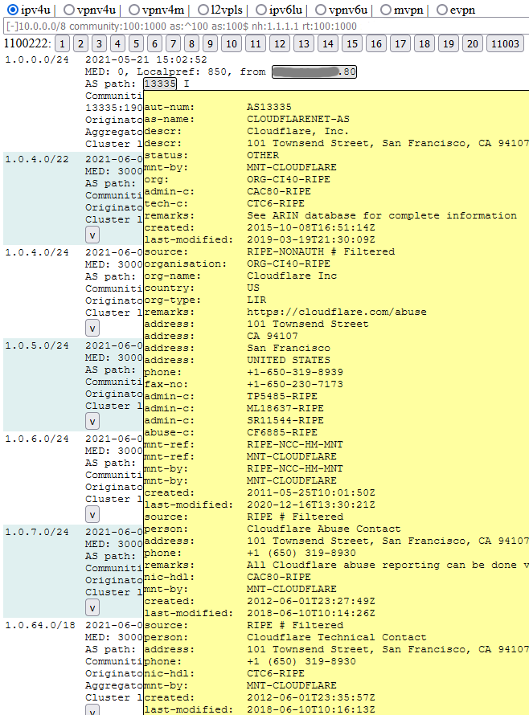

bgpexplorer
====================

## Description

This is a BGP route explorer for RIB (routing information database) with ability to drill-down routes change history.
It can be a BGP speaker (only listener exact) or BMP monitoring station.
bgpexplorer supports many NLRI types and path attribute kinds and intened to be a looking glass and "show route" replacement.
It is replacement for old BGPHist (https://sourceforge.net/projects/bgphist/). bgpexplorer is much more fast, beacause it store RIBs with history in the RAM.
RIB can be accessed via http protocol in JSON format. For your convinience bgpexplorer serves bundled files to provide basic web service, which can be used as backend for front web server (nginx or apache for example) with AAA.
All json endpoints located under /api/ URI.

## Quick start

At first you will need at least a BGP router to monitor :-). And some PC with Linux/FreeBSD (although Windows or Mac will work too, I hope).

At second you should configure your router to accept bgp connections from your PC.
For example, router you have has IP 10.0.0.1, AS 65535. PC with bgpexplorer has IP 10.1.1.1.
In Cisco dialect it will be something like:
```
router bgp 65535
 ! create a neighbor with your own AS, so it will be IBGP
 neighbor 10.1.1.1 remote-as 65535
 ! specify source IP
 neighbor 10.1.1.1 update-source Loopback0
 ! do not attempt to connect from router to PC, only from PC to router
 neighbor 10.1.1.1 transport connection-mode passive
 address-family ipv4
 ! it has ipv4 unicast address family
  neighbor 10.1.1.1 activate
 ! send all routing information to PC
  neighbor 10.1.1.1 route-reflector-client
 ! activate ipv4 labeled-unicast address family
  neighbor 10.1.1.1 send-label
 address-family vpnv4
 ! activate vpnv4 unicast address family
  neighbor 10.1.1.1 activate
  neighbor 10.1.1.1 send-community extended
```
Now on PC with Linux or FreeBSD:
```
$ git clone https://github.com/wladwm/bgpexplorer
... git messages
$ cd bgpexplorer
$ cargo build
... cargo messages
$ cat > bgpexplorer.ini <<EOF
[main]
httplisten=0.0.0.0:8080
httproot=contrib
whoisjsonconfig=whois.json
snapshot=snapshot.bgp

[s0]
mode=bgpactive
bgppeer=10.0.0.1
peeras=65535
EOF

$ cargo run
```

After this you should see something like:
```
Listening on http://0.0.0.0:8080
BGP trying 10.0.0.1:179
Connected to 10.0.0.1:179
```

After this you can open your favorite browser and point to http://10.1.1.1:8080/ - you should see bgpexplorer basic interface.

For example view for ipv4 unicast:
​

Or vpnv4 unicast:
​

## Configuration

bgpexplorer looks for configuration in file bgpexplorer.ini in current directory.
This file should have [main] section and peer sections with any other names
Main section parameters:
* httplisten - bind address and port for inner http server, default 0.0.0.0:8080.
* httproot - path for http server files serving root, default "./contrib/".
* whoisjsonconfig - json config for whois service, default is whois.json.
* whoisdb - path to store whois cache db, whoiscache.db by default.
* historydepth - how many history records should be kept for each route. 10 by default.
* historymode - differ/every. differ - record history event only if some attributes changed. every - anyway record history event.
* purge_after_withdraws - garbage collect after specified number of withdraws. 0 - turned off, this setting is by default.
* purge_every - garbage collect every N seconds. Default setting is 5 minutes.

Service section parameters:
* mode - protocol mode, can be bgpactive,bgppassive,bmpactive or bmppassive. bgp or bmp means protocol, active or passive determines which side will initiate session.
* bgppeer - bgp peer address for bgp active mode. Can be just IP address or IP:port. bgpexplorer will attempt to connect to specified BGP speaker.
* bmppeer - bmp peer address for bgp active mode. Can be IP:port or just IP address - then default port 632 will be used. bgpexplorer will attempt to connect to specified BMP-capable router.
* protolisten - TCP endpoint for bgp/bmp passived mode. Should be IP:port form. Please note that you will not be able to run process listening port number below 1024 in *nix OS if you are not root without special tricks.
* routerid - BGP router ID, if not specified, default value 1.1.1.1 will be used.
* peeras - BGP AS number for bgpactive.
* filter_rd - With BMP session this parametr will filter watching BGP session matching this RD. Default is 0:0 (global vrf).

BTW, builtin whois proxy allows you to see some info about AS and hosts:
​

## API endpoints

* /api/statistics
  * Parameters: None
  * Returns: RIB statistics object
  Example:
   {
     // attributes stores usage
    "stores":{"clusters":0,"pathes":20,"comms":7,"attrs":25,"lcomms":1,"extcomms":1},
    // routes count for each RIB
    "ribs":{"ipv4m":0,"fs4u":0,"l2vpls":0,"vpnv4u":0,"ipv4u":70,"vpnv4m":0,"mvpn":0,"ipv6u":0,"vpnv6m":0,"ipv6lu":0,"vpnv6u":0,"ipv4lu":0,"evpn":0},
    // counters for updates/withdraws
    "counters":{"updates":70,"withdraws":0}
   }
* /api/json/<RIB>?...
  * RIB - ipv4u, ipv4m ...
  URL parameters:
   * limit - maximum items count in response
   * skip - how many items to skip for paging
   * filter - textual filter 
* /api/whois/<ObjectType>?query=<text>
  Whois public service query
  * ObjectType - object type to query from public whois:
   * as - Autonomous system number
   * route - route object
   * route6  - route6 object
* /api/dns/<IP>
  Reverse DNS lookup

## Crates.io

https://crates.io/crates/bgpexplorer

## Documentation

https://docs.rs/bgpexplorer

## License

[MIT OR Apache-2.0](LICENSE)
